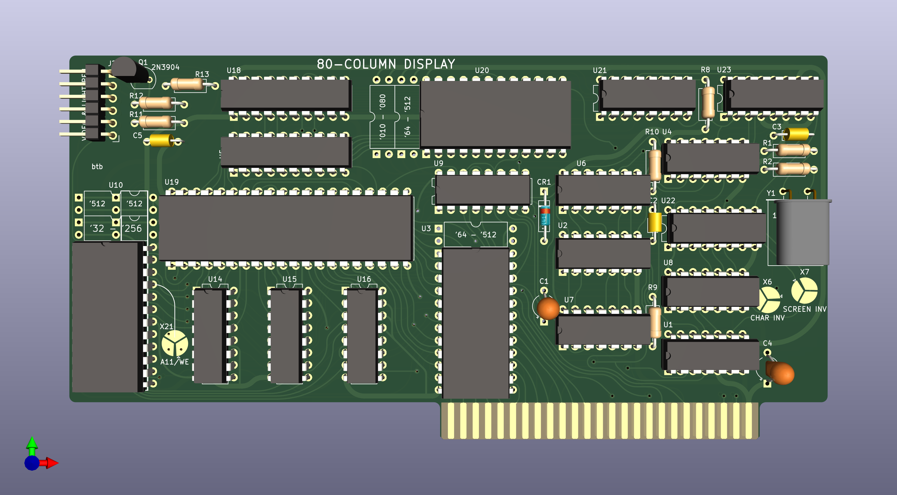

# 80ColumnCard
An 80-Column Card for the Apple II, II+, and clones.

This is mostly a clone of the Videx Videoterm, with some changes to reduce the number of chips needed.

[Interactive BOM](https://btb.github.io/80ColumnCard/hardware/80ColumnCard/bom/)

