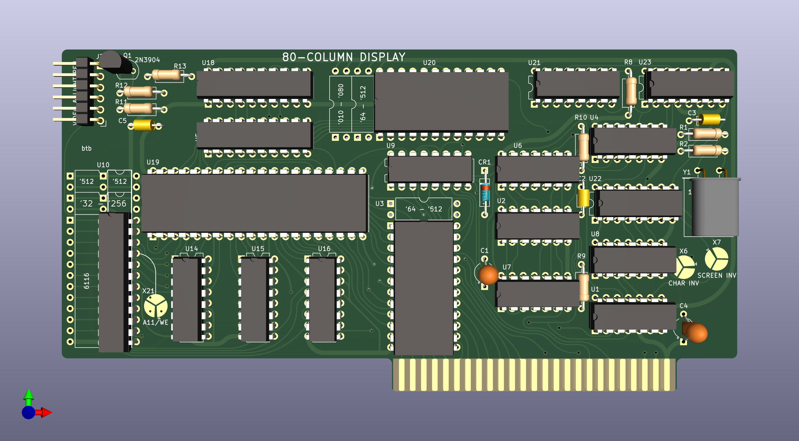

# 80ColumnCard
An Apple II 80-Column Card. Based on the Videx Videoterm

This is mostly a clone, with some changes to reduce the number of chips needed.

[Interactive BOM](https://btb.github.io/80ColumnCard/bom/)

